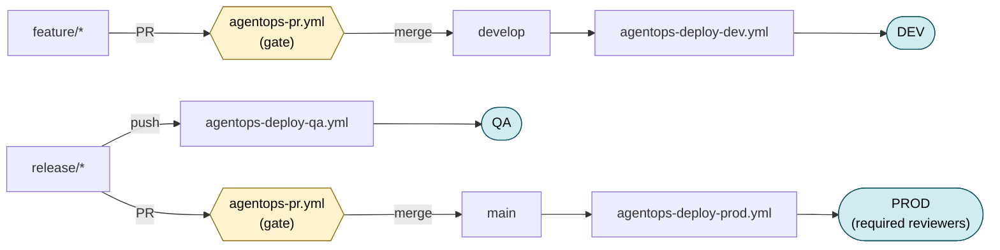

# AgentOps GenAIOps GitFlow on GitHub Actions

This guide shows how to wire AgentOps into a complete GenAIOps CI/CD
pipeline on GitHub Actions, mapped to a classic GitFlow branching model
with three deployment environments (`dev`, `qa`, `production`).

`agentops workflow generate` ships **four** ready-to-use templates that
form the full scaffold:

| File | Trigger | GitHub Environment | Purpose |
|---|---|---|---|
| `agentops-pr.yml` | PRs to `develop`, `release/**`, `main` | (none) | Eval gate. Fails the PR if thresholds drop. Comments report on PR. |
| `agentops-deploy-dev.yml` | push to `develop` | `dev` | Eval → build → deploy DEV |
| `agentops-deploy-qa.yml` | push to `release/**` | `qa` | Eval → build → deploy QA |
| `agentops-deploy-prod.yml` | push to `main` | `production` | Safety eval → build → deploy PROD (gated by required reviewers) |

## GitFlow assumed



If you are on trunk-based development, generate only the templates you
need: `agentops workflow generate --kinds pr,dev,prod`.

## Quick start

```bash
# 1. Make sure your eval works locally first.
agentops eval run

# 2. Generate the four workflows.
agentops workflow generate

# 3. Configure GitHub (see sections below):
#    - OIDC repo variables
#    - dev / qa / production environments
#    - branch protection on develop and main
#    - fill in Build / Deploy placeholders

# 4. Commit and push.
```

## Configuration walkthrough

### 1. Repository variables (OIDC)

In Settings → Secrets and variables → Actions → **Variables**, add:

| Variable | Purpose |
|---|---|
| `AZURE_CLIENT_ID` | App registration / managed identity used for federated login |
| `AZURE_TENANT_ID` | Azure AD tenant |
| `AZURE_SUBSCRIPTION_ID` | Target subscription |
| `AZURE_AI_FOUNDRY_PROJECT_ENDPOINT` | Foundry project URL (used by the eval step) |

Then on the Azure side, configure Workload Identity Federation
(federated credentials) on the app registration so it can be assumed
from GitHub Actions runs. See
[Microsoft's WIF docs](https://learn.microsoft.com/azure/active-directory/workload-identities/workload-identity-federation-create-trust?pivots=identity-wif-apps-methods-azp).

### 2. GitHub Environments

In Settings → Environments, create three:

#### `dev`
- Usually no protection rules.
- Override env-specific variables here (e.g. dev resource group, dev
  ACA app name).

#### `qa`
- Optional: restrict deployment branches to `release/**`.
- Override env-specific variables for QA infra.

#### `production`
- **Required reviewers**: at least one. Deploys to PROD pause until
  approved.
- Optional: **Wait timer** for an extra cool-down.
- Optional: **Deployment branches**: restrict to `main`.
- Override env-specific variables for production infra.

Environment-level variables override repo-level ones automatically
when the workflow's `environment:` matches.

### 3. Fill in Build and Deploy

Each `agentops-deploy-*.yml` ships with `Build (placeholder)` and
`Deploy (placeholder)` steps. The DEV template lists commented example
snippets for the most common patterns. Copy the relevant one into all
three deploy templates.

#### Container Apps

```yaml
# Build
- name: Build image
  run: |
    az acr build \
      --registry "${{ vars.ACR_NAME }}" \
      --image "myapp:${{ github.sha }}" \
      .

# Deploy
- name: Deploy to ACA
  run: |
    az containerapp update \
      --name "${{ vars.ACA_APP_NAME }}" \
      --resource-group "${{ vars.AZURE_RESOURCE_GROUP }}" \
      --image "${{ vars.ACR_NAME }}.azurecr.io/myapp:${{ github.sha }}"
```

#### App Service

```yaml
# Build
- uses: actions/setup-python@v5
  with: { python-version: "3.11" }
- run: pip install -r requirements.txt -t ./dist
- run: cp -r src ./dist/

# Deploy
- uses: azure/webapps-deploy@v3
  with:
    app-name: ${{ vars.WEBAPP_NAME }}
    package: ./dist
```

#### Foundry hosted agent

```yaml
# Build is typically empty: hosted agents are configured, not packaged.

# Deploy: publish a new agent version with whatever your project uses
# to manage Foundry agents (project-specific tooling).
```

#### azd-managed app

```yaml
# Build
- uses: Azure/setup-azd@v2
- run: azd package --no-prompt

# Deploy
- run: azd deploy --no-prompt
  env:
    AZURE_ENV_NAME: dev   # or qa / prod
```

### 4. Branch protection

In Settings → Branches, add a rule for **both `develop` and `main`**:

- ✅ Require a pull request before merging.
- ✅ Require status checks to pass: select
  **`AgentOps PR / Eval (PR gate)`**.
- (Optional) Require linear history.

This makes the AgentOps eval a hard merge requirement.

## Exit codes

The eval step uses the AgentOps exit code contract to gate deploys:

| Exit code | Meaning | Job result |
|---|---|---|
| `0` | Eval ran, all thresholds passed | ✅ pass |
| `2` | Eval ran, one or more thresholds failed | ❌ fail (deploy never runs) |
| `1` | Runtime / config error | ❌ fail |

## Artifacts

Each workflow uploads (always — even on failure):

- `results.json` — machine-readable, versioned
- `report.md` — human-readable
- `cloud_evaluation.json` — present when using Foundry cloud evaluation;
  contains a deep link to the New Foundry Experience Evaluations page

Artifact names per workflow:

| Workflow | Artifact name |
|---|---|
| `agentops-pr.yml` | `agentops-pr-results` |
| `agentops-deploy-dev.yml` | `agentops-dev-results` |
| `agentops-deploy-qa.yml` | `agentops-qa-results` |
| `agentops-deploy-prod.yml` | `agentops-prod-results` |

## CLI reference

```bash
agentops workflow generate                     # all four templates (default)
agentops workflow generate --kinds pr,dev,prod # subset (trunk-based)
agentops workflow generate --force             # overwrite existing files
agentops workflow generate --dir <path>        # different repo root
```

| Flag | Description | Default |
|---|---|---|
| `--kinds` | Comma-separated subset of `pr,dev,qa,prod` | all four |
| `--force` | Overwrite existing workflow files | `false` |
| `--dir` | Repository root | `.` |

## Customisation tips

- **Tighten thresholds for QA / PROD** — copy `.agentops/run.yaml` to
  `.agentops/run-qa.yaml` / `.agentops/run-prod.yaml` and tighten
  thresholds in the bundle. Update the `inputs.config` default in the
  matching workflow file.
- **Scheduled runs** — add a `schedule:` entry in `agentops-pr.yml` (or
  a new file) to evaluate against `main` nightly.
- **Matrix per scenario** — if you have multiple `runs/*.yaml`, extend
  the eval job with `strategy.matrix.config:` and reference
  `${{ matrix.config }}` in the eval step.
- **Regression baseline** — wire deploy templates to download the
  previous run's `results.json` artifact and call
  `agentops eval compare` between the two.

## Migration from the older 3-template layout

If your repository still has `agentops-eval.yml`, `agentops-eval-ci.yml`,
or `agentops-eval-cd.yml` from a prior version of AgentOps:

1. Delete the three old files.
2. Run `agentops workflow generate`.
3. Re-add Build / Deploy commands you had customised.
4. Update branch-protection status checks to point at the new
   `AgentOps PR` job.
