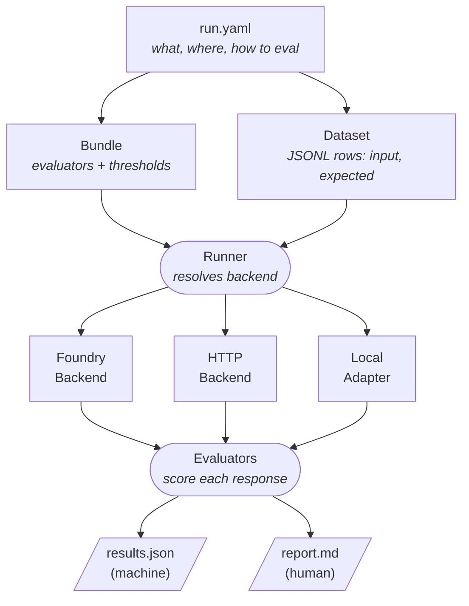

# Concepts

This page explains the core building blocks of AgentOps and how they fit together. For the full schema reference and architecture details, see [how-it-works.md](how-it-works.md).

## How an Evaluation Works



> Exit code: `0` = pass, `2` = threshold fail, `1` = error

## Core Concepts

### Workspace

The `.agentops/` directory inside your project root. Created by `agentops init`, it holds all evaluation configuration: run configs, bundles, datasets, data files, and results.

```
.agentops/
├── config.yaml          # workspace defaults
├── run.yaml             # default run config
├── bundles/             # evaluation policies
├── datasets/            # dataset definitions (YAML)
├── data/                # dataset rows (JSONL)
└── results/             # run outputs + latest/ pointer
```

### Run Config

A YAML file (typically `run.yaml`) that connects **what** to evaluate, **how** to reach it, and **which evaluators** to apply. It references one bundle and one dataset.

A run config has three key dimensions:

| Dimension | Values | Purpose |
|---|---|---|
| `target.type` | `agent`, `model` | What is being evaluated |
| `target.execution_mode` | `local`, `remote` | How AgentOps reaches the target |
| `target.endpoint.kind` | `foundry_agent`, `http` | Remote endpoint type (when remote) |

Minimal example:

```yaml
version: 1
target:
  type: agent
  hosting: foundry
  execution_mode: remote
  endpoint:
    kind: foundry_agent
    agent_id: my-agent:1
    model: gpt-4o
    project_endpoint_env: AZURE_AI_FOUNDRY_PROJECT_ENDPOINT
bundle:
  name: rag_quality_baseline
dataset:
  name: smoke-rag
```

See [how-it-works.md](how-it-works.md) for the full schema, all fields, and validation rules.

### Bundle

A YAML file that defines **which evaluators** to run and **what thresholds** to enforce. Bundles are reusable — the same bundle can evaluate different targets across environments.

Each bundle contains:
- A list of evaluators (AI-assisted or local metrics)
- Threshold rules that determine pass/fail

```yaml
# .agentops/bundles/model_quality_baseline.yaml
evaluators:
  - name: SimilarityEvaluator
    source: foundry
    enabled: true
thresholds:
  - metric: SimilarityEvaluator
    operator: ">="
    value: 3.0
```

See [bundles.md](bundles.md) for the full bundle authoring guide.

### Dataset

A YAML config that points to a JSONL file containing evaluation rows. Each row has an `input` (the prompt) and an `expected` (the reference answer). Some scenarios add extra fields like `context` (RAG) or `tool_calls` (agent workflows).

```yaml
# .agentops/datasets/smoke-model-direct.yaml
source:
  type: file
  path: ../data/smoke-model-direct.jsonl
format:
  type: jsonl
  input_field: input
  expected_field: expected
```

```json
{"id": "1", "input": "What is Python?", "expected": "Python is a programming language."}
```

### Evaluator

A scoring function that measures one aspect of the target's response. Evaluators can be:

- **AI-assisted** (Foundry) — use a judge model to score responses on criteria like coherence, fluency, or groundedness (1-5 scale)
- **Local metrics** — computed without a model, such as `F1ScoreEvaluator` or `avg_latency_seconds`

Evaluators are configured inside bundles. See [foundry-evaluation-sdk-built-in-evaluators.md](foundry-evaluation-sdk-built-in-evaluators.md) for the complete evaluator reference.

### Backend

The execution engine that sends dataset rows to the target and collects responses. The runner automatically selects the backend based on the run config:

| Execution Mode | Endpoint Kind | Backend | Use case |
|---|---|---|---|
| `remote` | `foundry_agent` | Foundry Backend | Foundry agents and models |
| `remote` | `http` | HTTP Backend | LangGraph, LangChain, ACA, custom REST |
| `local` | — | Local Adapter | In-process Python functions or subprocess |

## Evaluation Scenarios

AgentOps ships starter bundles for common evaluation patterns. Each bundle pairs specific evaluators with default thresholds:

| Scenario | Bundle | Key Evaluators | When to use |
|---|---|---|---|
| **Model Quality** | `model_quality_baseline` | Similarity, Coherence, Fluency, F1Score | Direct model deployment checks |
| **RAG** | `rag_quality_baseline` | Groundedness, Relevance, Retrieval, ResponseCompleteness | RAG pipelines with context retrieval |
| **Conversational** | `conversational_agent_baseline` | Coherence, Fluency, Relevance, Similarity | Chatbots, Q&A assistants |
| **Agent Workflow** | `agent_workflow_baseline` | TaskCompletion, ToolCallAccuracy, IntentResolution, ToolSelection | Agents with tool calling |
| **Content Safety** | `safe_agent_baseline` | Violence, Sexual, SelfHarm, HateUnfairness, ProtectedMaterial | Responsible AI checks |

Each scenario has a dedicated tutorial:

- [Model-direct evaluation](tutorial-model-direct.md)
- [Foundry agent evaluation](tutorial-basic-foundry-agent.md)
- [RAG evaluation](tutorial-rag.md)
- [Conversational agent evaluation](tutorial-conversational-agent.md)
- [Agent workflow evaluation](tutorial-agent-workflow.md)
- [HTTP-deployed agent evaluation](tutorial-http-agent.md)

## Configuration Model

Run configs use an orthogonal target model. The three key dimensions — `type`, `execution_mode`, and `endpoint.kind` — are independent. Additional optional fields:

| Field | Values | When to use |
|---|---|---|
| `target.hosting` | `local`, `foundry`, `aks`, `containerapps` | Metadata: where the target runs |
| `target.framework` | `agent_framework`, `langgraph`, `custom` | Agent targets only |
| `target.agent_mode` | `prompt`, `hosted` | Foundry agents only |

**Bundle and dataset references** support two resolution modes:
- `name` — convention-based: resolves to `.agentops/bundles/<name>.yaml` or `.agentops/datasets/<name>.yaml`
- `path` — explicit relative path to the YAML file

See [how-it-works.md](how-it-works.md) for the full schema, all endpoint fields, validation rules, and more configuration examples.
