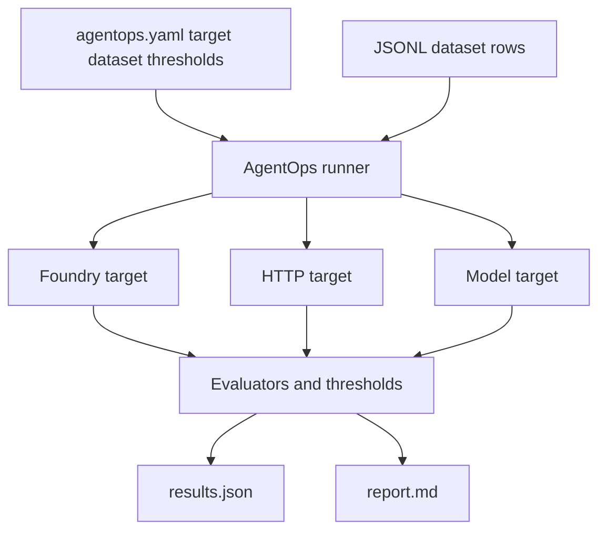

# Concepts

This page explains the core AgentOps building blocks. For the full schema
reference and architecture details, see [how-it-works.md](how-it-works.md).

## AgentOps + Microsoft Foundry

AgentOps helps teams answer two release questions for a Foundry agent:
**can we ship it, and where is the proof?**

Foundry owns the agent lifecycle: create, deploy, run, trace, monitor, evaluate,
and investigate. AgentOps adds the repo-controlled proof that a candidate is
ready to release:

- Source-controlled eval config
- Local and CI quality gates
- Stable `results.json` and PR-friendly `report.md`
- Doctor diagnostics and release evidence
- Trace-to-dataset promotion
- Generated workflows and a local Cockpit

Use Foundry for runtime and official drilldown. Use AgentOps for the
release-readiness loop: initialize, evaluate, compare, run Doctor, produce
evidence, and promote reviewed traces back into regression data.

The short version is: **Foundry runs the agent. AgentOps proves the release is
ready.**

## How an Evaluation Works



> Exit code: `0` = pass, `2` = threshold fail, `1` = error

## Core Concepts

### Workspace

Created by `agentops init`. The release-gate config lives in the flat
`agentops.yaml` file at the project root. `.agentops/` is the
AgentOps-managed workspace for seed inputs, local run history, Doctor cache,
and generated release evidence. It is not a second `.foundry/` directory.

```text
agentops.yaml          # flat config: agent, dataset, thresholds
.agentops/
├── data/              # dataset rows (JSONL)
├── results/           # run outputs + latest/ pointer
├── agent/             # Doctor history and reports
└── release/           # evidence.json/evidence.md when generated
```

### AgentOps Config

A YAML file named `agentops.yaml` that connects **what** to evaluate,
**which dataset** to use, and **which thresholds** gate the run.

The minimum is:

```yaml
version: 1
agent: "my-agent:1"
dataset: .agentops/data/smoke.jsonl
```

Common `agent:` values:

| Agent value | Target kind |
|---|---|
| `"support-bot:1"` | Foundry prompt agent (`name:version`) |
| `"https://...services.ai.azure.com/.../agents/<id>"` | Foundry hosted agent endpoint |
| `"https://api.example.com/chat"` | HTTP/JSON agent |
| `"model:gpt-4o-mini"` | Direct model deployment |

HTTP targets can add top-level mapping fields such as `request_field`,
`response_field`, `tool_calls_field`, `auth_header_env`, and
`extra_fields`.

### Dataset

A JSONL file containing evaluation rows. Each row has an `input` prompt
and usually an `expected` reference answer. Some scenarios add extra
fields like `context` (RAG), `tool_definitions`, or `tool_calls` (agent
workflows).

```json
{"id": "1", "input": "What is Python?", "expected": "Python is a programming language."}
```

### Evaluator

A scoring function that measures one aspect of the target response.
Evaluators can be:

- **AI-assisted** (Foundry) - use a judge model to score responses on
  criteria like coherence, fluency, similarity, or groundedness.
- **Local metrics** - computed without a judge model, such as
  `F1ScoreEvaluator` or `avg_latency_seconds`.

AgentOps auto-selects evaluators from the target kind and dataset shape.
Use `evaluators:` in `agentops.yaml` only when you need to override that
selection. See
[foundry-evaluation-sdk-built-in-evaluators.md](foundry-evaluation-sdk-built-in-evaluators.md)
for the complete evaluator reference.

### Target resolver

The execution engine sends dataset rows to the target and collects
responses. AgentOps automatically selects the target kind from `agent:`.

| `agent:` shape | Target kind | Use case |
|---|---|---|
| `name:version` | Foundry prompt agent | Foundry Agent Service agents |
| `https://...services.ai.azure.com/.../agents/...` | Foundry hosted agent endpoint | Hosted Agent URL target |
| `https://...` | HTTP/JSON endpoint | LangGraph, Agent Framework, ACA, AKS, custom REST |
| `model:<deployment>` | Model-direct | Raw model deployment checks |

### Prompt Agent vs Hosted Agent

| Term | What it means | Who creates/deploys it | How AgentOps uses it |
|---|---|---|---|
| **Foundry Prompt Agent** | A Foundry-managed agent version referenced as `name:version`. | Foundry portal, Foundry SDK/Toolkit, or `microsoft-foundry` skill. | Can run locally through AgentOps or server-side with `execution: cloud`. |
| **Foundry Hosted Agent** | A deployed agent endpoint on a Foundry domain. | Foundry Agent Service / Hosted Agent tooling. | Evaluated as a URL target by the AgentOps local runner. |
| **HTTP/JSON agent** | A custom endpoint outside the Foundry agent URL shape. | The app's own deployment path, often azd, ACA, AKS, or another host. | Evaluated as a URL target with request/response mapping fields. |

AgentOps does not replace the tools that create or deploy agents. It references
the candidate that those tools produced and turns the evaluation, Doctor, and
evidence outputs into a release gate.

### Evaluation path

| Target | Foundry server-side eval through AgentOps | AgentOps local runner | Recommended default |
|---|---|---|---|
| Foundry Prompt Agent (`name:version`) | Yes, with `execution: cloud` | Yes | Use cloud for official Foundry-hosted runs; use local for fast feedback or fallback. |
| Foundry Hosted Agent URL | No | Yes | Use local runner; optionally publish local metrics to Foundry with `publish: true`. |
| Generic HTTP/JSON endpoint | No | Yes | Use local runner. |
| Raw model deployment (`model:<name>`) | No | Yes | Use local runner. |

For CI pipelines that only need a supported Foundry-native eval, prefer
Microsoft Foundry AI Agent Evaluation. Use AgentOps when the repo also needs
thresholds, baselines, local fallback, Doctor readiness, release evidence, or
trace-to-regression review.

## Evaluation Scenarios

AgentOps auto-selects common evaluation patterns from the dataset:

| Scenario | Signal | Purpose |
|---|---|---|
| **Model quality** | `model:<deployment>` + `expected` | Direct model checks |
| **RAG** | `context` | Grounding and retrieval checks |
| **Conversational** | `input` + `expected` | Chatbot and Q&A quality |
| **Agent workflow** | `tool_calls` + `tool_definitions` | Tool-use quality |
| **Content safety** | Safety evaluators | Responsible AI checks |

Use one of the three hands-on tutorials for scenario coverage:

- [Prompt Agent quickstart](tutorial-prompt-agent-quickstart.md) for Foundry
  prompt agents referenced as `name:version`.
- [Hosted Agent quickstart](tutorial-hosted-agent-quickstart.md) for Foundry
  hosted endpoints, generic HTTP agents, RAG services, and code-based workflows.
- [End-to-end workshop](tutorial-end-to-end.md) for the complete Foundry +
  AgentOps loop, including CI/CD, observability, red-team follow-through,
  Doctor, release evidence, and trace regression.

## Configuration Model

`agentops.yaml` is the single source of truth. Keep it small and add only
the fields your target needs:

```yaml
version: 1
agent: "https://api.example.com/chat"
dataset: .agentops/data/support.jsonl

request_field: message
response_field: text

thresholds:
  coherence: ">=3"
  avg_latency_seconds: "<=2"
```

See [how-it-works.md](how-it-works.md) for the full schema, endpoint
fields, validation rules, and more examples.
