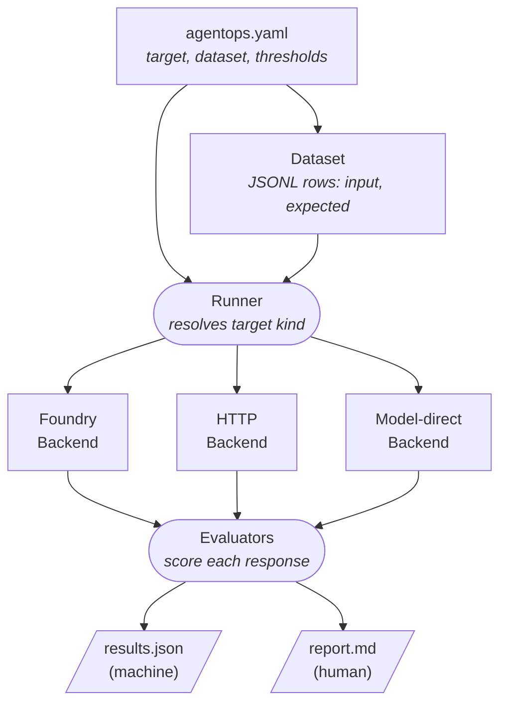

# Concepts

This page explains the core AgentOps building blocks. For the full schema
reference and architecture details, see [how-it-works.md](how-it-works.md).

## How an Evaluation Works



> Exit code: `0` = pass, `2` = threshold fail, `1` = error

## Core Concepts

### Workspace

Created by `agentops init`. The evaluation config lives in the flat
`agentops.yaml` file at the project root; `.agentops/` stores seed data,
run history, and optional supporting files.

```text
agentops.yaml          # flat config: agent, dataset, thresholds
.agentops/
├── data/              # dataset rows (JSONL)
└── results/           # run outputs + latest/ pointer
```

### AgentOps Config

A YAML file named `agentops.yaml` that connects **what** to evaluate,
**which dataset** to use, and **which thresholds** gate the run.

The minimum is:

```yaml
version: 1
agent: "my-agent:1"
dataset: .agentops/data/smoke.jsonl
```

Common `agent:` values:

| Agent value | Target kind |
|---|---|
| `"support-bot:1"` | Foundry prompt agent (`name:version`) |
| `"https://api.example.com/chat"` | HTTP/JSON agent |
| `"model:gpt-4o-mini"` | Direct model deployment |

HTTP targets can add top-level mapping fields such as `request_field`,
`response_field`, `tool_calls_field`, `auth_header_env`, and
`extra_fields`.

### Dataset

A JSONL file containing evaluation rows. Each row has an `input` prompt
and usually an `expected` reference answer. Some scenarios add extra
fields like `context` (RAG), `tool_definitions`, or `tool_calls` (agent
workflows).

```json
{"id": "1", "input": "What is Python?", "expected": "Python is a programming language."}
```

### Evaluator

A scoring function that measures one aspect of the target response.
Evaluators can be:

- **AI-assisted** (Foundry) — use a judge model to score responses on
  criteria like coherence, fluency, similarity, or groundedness.
- **Local metrics** — computed without a judge model, such as
  `F1ScoreEvaluator` or `avg_latency_seconds`.

AgentOps auto-selects evaluators from the target kind and dataset shape.
Use `evaluators:` in `agentops.yaml` only when you need to override that
selection. See
[foundry-evaluation-sdk-built-in-evaluators.md](foundry-evaluation-sdk-built-in-evaluators.md)
for the complete evaluator reference.

### Target resolver

The execution engine sends dataset rows to the target and collects
responses. AgentOps automatically selects the target kind from `agent:`.

| `agent:` shape | Target kind | Use case |
|---|---|---|
| `name:version` | Foundry prompt agent | Foundry Agent Service agents |
| `https://...` | HTTP/JSON endpoint | LangGraph, Agent Framework, ACA, AKS, custom REST |
| `model:<deployment>` | Model-direct | Raw model deployment checks |

## Evaluation Scenarios

AgentOps auto-selects common evaluation patterns from the dataset:

| Scenario | Dataset signal | Key evaluators | When to use |
|---|---|---|---|
| **Model Quality** | `input`, `expected` on `model:<deployment>` | Similarity, Coherence, Fluency, F1Score | Direct model deployment checks |
| **RAG** | `context` | Groundedness, Relevance, Retrieval, ResponseCompleteness | RAG pipelines with context retrieval |
| **Conversational** | `input`, `expected` on an agent | Coherence, Fluency, Similarity/F1 where applicable | Chatbots, Q&A assistants |
| **Agent Workflow** | `tool_calls`, `tool_definitions` | ToolCallAccuracy, IntentResolution, TaskAdherence | Agents with tool calling |
| **Content Safety** | Explicit safety evaluators | Violence, Sexual, SelfHarm, HateUnfairness, ProtectedMaterial | Responsible AI checks |

Each scenario has a dedicated tutorial:

- [Model-direct evaluation](tutorial-model-direct.md)
- [Foundry agent evaluation](tutorial-basic-foundry-agent.md)
- [RAG evaluation](tutorial-rag.md)
- [Conversational agent evaluation](tutorial-conversational-agent.md)
- [Agent workflow evaluation](tutorial-agent-workflow.md)
- [HTTP-deployed agent evaluation](tutorial-http-agent.md)

## Configuration Model

`agentops.yaml` is the single source of truth. Keep it small and add only
the fields your target needs:

```yaml
version: 1
agent: "https://api.example.com/chat"
dataset: .agentops/data/support.jsonl

request_field: message
response_field: text

thresholds:
  coherence: ">=3"
  avg_latency_seconds: "<=2"
```

See [how-it-works.md](how-it-works.md) for the full schema, endpoint
fields, validation rules, and more examples.
