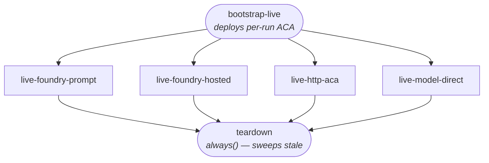

# Live E2E architecture

Short architectural note for `infra/e2e/` and the live jobs in
`.github/workflows/e2e.yml`. The end-user setup guide is in
[`e2e-live-setup.md`](e2e-live-setup.md).

## Goal

Exercise all four AgentOps backends against real Azure resources on every
manual workflow dispatch, while keeping per-run cost and time bounded.

## Layered provisioning (hybrid efemeridade)

| Layer | When | What | Why |
|---|---|---|---|
| **Bootstrap** | One-time, by the user (`infra/e2e/bootstrap.bicep`) | AI Services account, Foundry project, `gpt-4o-mini` deployment, ACA managed environment, Log Analytics, ACR | Heavy/slow resources whose creation dwarfs the actual eval. Idle cost ≈ $0. |
| **Per-run** | Every workflow dispatch (`infra/e2e/perrun.bicep`) | One ACA echo app named `aca-echo-run<github.run_id>` | Cheap, fast (<30s) artifact tied to the specific run. Lets `http-aca` test a fresh URL each time. |
| **Manual** | One-time, in the Foundry portal | Prompt agent (`e2e-prompt:1`) and (optional) hosted agent endpoint | Foundry agent CRUD has no Bicep coverage and the SDK surface is moving fast. Stable Variables in the repo are simpler than dynamic creation today. |

## Auth

GitHub Actions ↔ Entra federated credential. The workflow declares
`permissions: id-token: write` and uses `azure/login@v2` with
`client-id` / `tenant-id` / `subscription-id` from repo Actions
**Variables**. No client secrets exist anywhere. The login propagates to
`az`, `DefaultAzureCredential` (Python), and `azure-ai-projects` via the
env vars `azure/login` exports.

The repo never holds Azure credentials. Compromising the repo cannot
exfiltrate any usable Azure credential — only the trust policy on the
Entra app needs to be revoked to cut access.

## Job graph

`bootstrap-live` only runs `perrun.bicep` if the requested scenarios
include `http-aca`. The four scenario jobs each render their own
`agentops.yaml` via `scripts/e2e_render_config.py`, run `agentops eval`,
and upload `.agentops/results/` as an artifact. `teardown-live` deletes
the per-run app and runs a defensive sweep for any `aca-echo-run*` older
than one day.

## Why no agent provisioning script

Earlier drafts included `scripts/e2e_create_agents.py` to create Foundry
agents on every run. We pulled it because:

1. Agent CRUD APIs in `azure-ai-projects` are still preview-shaped.
2. Agent creation is fast in the portal and only needed once.
3. A failure in agent creation would block all live scenarios, even the
   non-Foundry ones.

If a future SDK release stabilises the agent management surface, an
opt-in `--ephemeral-agent` mode is straightforward to add: it would slot
into `bootstrap-live` and write its own GitHub Output that the prompt
scenario consumes.

## Out of scope for v1

- Hosted Foundry agent image build + ACR push + endpoint provisioning.
- Async hosted agent lifecycle (`background: true`).
- Per-event SSE evaluation for Invocations agents.

These are tracked in the broader 1.0 plan and will move to v1.1.
