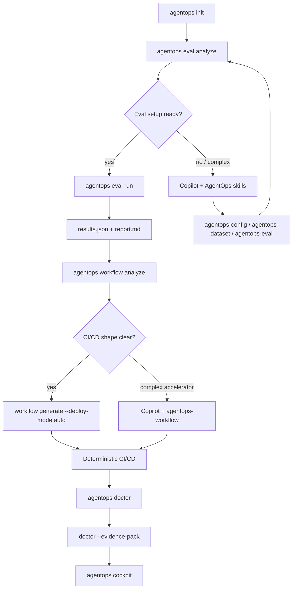
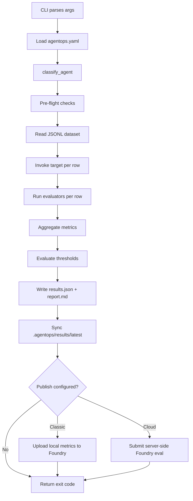
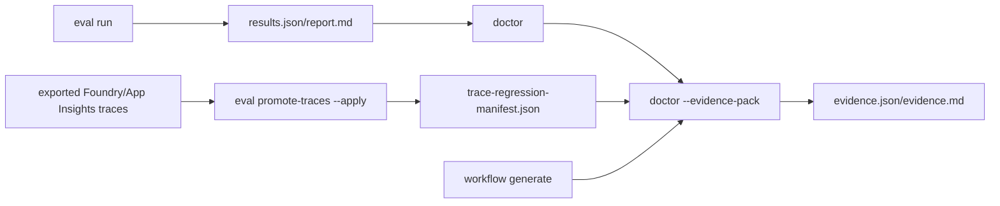
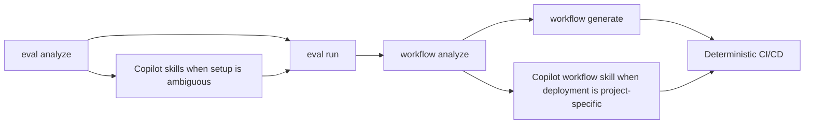

# How It Works

This document is the single source of truth for understanding the AgentOps architecture. Read it before making any changes.

## What Is AgentOps?

AgentOps is a **standalone Python CLI, local Cockpit, and skill set** that helps
teams answer the Foundry release question: **can we ship this agent, and where
is the proof?** It:

1. Reads the flat `agentops.yaml` configuration plus JSONL dataset rows.
2. Executes evaluation against a target (Foundry agent, model deployment, HTTP endpoint, or local adapter).
3. Produces normalized outputs: `results.json` (machine-readable) and `report.md` (human-readable).
4. Returns CI-friendly exit codes: `0` pass, `2` threshold failure, `1` error.
5. Writes release evidence with `agentops doctor --evidence-pack`.

Foundry owns agent creation, deployment, runtime, traces, monitoring,
red-teaming, datasets, and Microsoft-hosted evaluation drilldown. AgentOps
references the candidate those tools produced and adds the repo-controlled
release proof:
config, gates, artifacts, PR reports, Doctor diagnostics, release evidence,
trace-to-regression promotion, and Cockpit links back to Foundry/Azure Monitor.

### Key Principles

| Principle | What It Means in Practice |
|---|---|
| **Thin CLI** | `cli/app.py` parses args and delegates to services. |
| **Core is pure** | `core/` transforms data without Azure imports or network calls. |
| **Lazy Azure imports** | Azure SDK imports stay inside runtime functions. |
| **Pydantic v2** | YAML configs and JSON outputs use Pydantic models. |
| **pathlib.Path only** | No raw string paths anywhere in the codebase. |
| **No global state** | No singletons, no module-level side effects. |

## Source Code Layout (src layout)

```
src/
└── agentops/
    ├── __init__.py            # Package root (version only)
    ├── __main__.py            # Enables `python -m agentops`
    │
    ├── cli/
    │   └── app.py             # Typer CLI definition (init, eval analyze/run/promote-traces,
    │                              # workflow analyze/generate, skills, mcp, agent)
    │
    ├── core/                  # Pure data layer - no Azure imports, no I/O
    │   ├── agentops_config.py # Flat 1.0 `agentops.yaml` Pydantic schema
    │   ├── config_loader.py   # YAML → AgentOpsConfig
    │   ├── evaluators.py      # Evaluator catalog (presets + auto-selection)
    │   ├── release_evidence.py # ReleaseEvidence schema
    │   └── results.py         # RunResult / RowResult / TargetInfo / RunSummary
    │
    ├── pipeline/              # Run orchestration - ADD execution flows here
    │   ├── orchestrator.py    # End-to-end `eval run` driver
    │   ├── runtime.py         # Pre-flight checks (deps, creds, endpoints)
    │   ├── invocations.py     # Per-row agent / model invocation strategies
    │   ├── thresholds.py      # Threshold pass/fail evaluation
    │   ├── reporter.py        # Markdown report generation
    │   ├── comparison.py      # Baseline delta rendering for `eval run --baseline`
    │   ├── publisher.py       # Classic Foundry publish (OneDP upload of metrics)
    │   └── cloud_runner.py # New Foundry publish (server-side via OpenAI Evals API)
    │
    ├── services/              # Workspace / project tooling
    │   ├── eval_analysis.py   # `agentops eval analyze` read-only triage
    │   ├── workflow_analysis.py # `agentops workflow analyze` CI/CD triage
    │   ├── initializer.py     # `agentops init` workspace scaffolding
    │   ├── skills.py          # Coding agent skill installation
    │   ├── cicd.py            # CI/CD workflow generation
    │   ├── evidence_pack.py   # Release evidence aggregation/writer
    │   └── trace_promotion.py # Trace export → dataset candidates
    │
    ├── agent/                 # `agentops doctor|serve` watchdog
    ├── mcp/                   # `agentops mcp serve` Model Context Protocol server
    │
    ├── utils/                 # Shared helpers (yaml load, logging, colors)
    │
    └── templates/             # Starter files for `agentops init`
        ├── agentops.yaml      # Minimal flat config (the single config file)
        ├── smoke.jsonl        # Sample dataset
        ├── agent.yaml         # Doctor config seed
        ├── skills/            # Coding agent skill templates
        ├── workflows/         # GitHub Actions workflow templates
        ├── pipelines/         # Azure DevOps pipeline templates
        └── agent-server/      # Doctor-as-Copilot-Extension deploy scaffold
```

### Where to Add New Code

| I want to… | Directory / File |
|---|---|
| Add a field to `agentops.yaml` | `core/agentops_config.py` |
| Add a new evaluator preset | `core/evaluators.py` (catalog) |
| Change pre-flight checks | `pipeline/runtime.py` |
| Add a target kind | `pipeline/invocations.py` + `core/agentops_config.py` |
| Tweak the report layout | `pipeline/reporter.py` |
| Add a publish destination | `pipeline/publisher.py` or `pipeline/cloud_runner.py` |
| Add a CLI command | `cli/app.py` + a service/pipeline helper |
| Add a starter template | `templates/` + update `pyproject.toml` package-data |
| Add a coding agent skill | `templates/skills/<name>/SKILL.md` + sync script |

## Request Flow (eval run)

For an unfamiliar repo, run `agentops eval analyze` first. It is a read-only
triage step: it inspects `agentops.yaml`, dataset columns, and local project
signals, then tells you whether `agentops eval run` is ready or whether Copilot
should use `agentops-config`, `agentops-dataset`, or `agentops-eval` to adapt
the setup.



For AI Landing Zone projects, `workflow analyze` surfaces the official
`scripts/Invoke-PreflightChecks.ps1` path when present. Generated azd workflows
run that preflight before `azd provision`, and Doctor reports AI Landing Zone
deployment readiness under Operational Excellence so teams can see whether
preflight, eval config, workflow deployment, and private-network runner planning
are wired together.

When you run `agentops eval run`, the following happens step by step:



Exit codes are `0` when all thresholds pass, `2` when one or more thresholds
fail, and `1` for runtime or configuration errors.

## POC-to-production readiness flow

AgentOps does not create a second production gate with a new exit-code
contract. Instead, it projects the signals already produced by evals, Doctor,
workflow files, Foundry control-plane checks, Azure Monitor, AI Landing Zone
readiness, and trace-regression manifests into a release evidence pack:



- `evidence.json` is the stable machine-readable contract (`version: 1`).
- `evidence.md` is the PR/release-review summary.
- `ready`, `ready_with_warnings`, and `blocked` are projections of existing
  signals; eval and Doctor exit codes remain unchanged.
- Trace promotion is local and review-first. `self-similarity` labels are useful
  for drift detection, not human-verified correctness; use `--label-mode pending`
  when a person must fill expected answers before the dataset can gate.

## Analyze / Generate Boundary

The `analyze` commands are intentionally deterministic and local-only. They do
not call models, Copilot, Azure, Foundry, GitHub, or Azure DevOps. Their job is
to say whether the next deterministic command is safe or whether the user should
ask Copilot to apply the matching skill.

When a skill handoff is needed, the analysis output keeps it copy/pasteable:
it reports whether AgentOps Copilot skills are installed in the repo, suggests
`agentops skills install --platform copilot` when they are missing, and prints a
single prompt to paste into Copilot.



## CLI Commands

| Command | Purpose |
|---|---|
| `agentops --version` | Print the installed version |
| `agentops explain [COMMAND...]` | Long-form, paged manual for any command (top-level dispatcher) |
| `agentops init` | Idempotent scaffold + azd-style wizard + skill install (the only onboarding command) |
| `agentops init show` | Inspect resolved config (`agentops.yaml` + `.azure/<env>/.env`) |
| `agentops init explain` | Long-form `init` manual |
| `agentops eval analyze` | Inspect eval setup and recommend direct run vs skill-assisted configuration |
| `agentops eval run` | Run an evaluation; the main command |
| `agentops eval run --baseline <results.json>` | Run an eval and add a baseline comparison section to the report |
| `agentops eval promote-traces` | Convert local trace exports into reviewable regression dataset rows |
| `agentops report generate` | Regenerate `report.md` from a `results.json` |
| `agentops doctor [--evidence-pack]` | Run the AgentOps Doctor and optionally write release evidence |
| `agentops doctor explain` | Long-form Doctor manual |
| `agentops cockpit` | Local read-only Cockpit UI (FastAPI) that links out to Foundry |
| `agentops workflow analyze` | Inspect a repo and recommend CI/CD stages/deploy mode before generation |
| `agentops workflow generate` | Generate CI/CD workflows for GitHub Actions or Azure DevOps |
| `agentops skills install` | (Re)install coding-agent skills (Copilot or Claude) |
| `agentops mcp serve` | Run AgentOps as an MCP server for code agents |
| `agentops agent serve` | Run the Doctor as a Copilot Extension / FastAPI server |

Every command supports `--help` for a terse description; long-form,
paged documentation is accessible through `agentops explain` (or the
local `… explain` subcommand where one exists).

## Exit Code Contract

Exit codes are part of the public API. **Do not change their meaning.**

| Code | Meaning |
|---|---|
| `0` | Execution succeeded **and** all thresholds passed |
| `2` | Execution succeeded **but** one or more thresholds failed |
| `1` | Runtime or configuration error |

## User Workspace Structure (`agentops.yaml` + `.agentops/` + `.azure/`)

The flat 1.0 schema places **one config file** at the project root and a
small directory for datasets, run history, and (optionally) skills.
`agentops init` also bootstraps an azd-compatible `.azure/<env>/.env`
file so the same workspace can be driven by AgentOps and `azd`.

```
<project root>/
├── agentops.yaml              # Single source of truth (flat 1.0 schema)
├── .agentops/
│   ├── data/
│   │   └── smoke.jsonl        # Sample dataset (created by `agentops init`)
│   ├── results/
│   │   ├── 2026-05-06T14-30-22Z/  # Timestamped run (immutable history)
│   │   │   ├── results.json
│   │   │   ├── report.md
│   │   │   └── cloud_evaluation.json   # only when `publish:` was set
│   │   └── latest/                # Mirror of the most recent run
│   └── agent/                 # Doctor history (history.jsonl + report.md)
├── .azure/                    # azd-compatible env folder (shared with azd)
│   ├── config.json            # `defaultEnvironment` pointer
│   ├── .gitignore
│   └── dev/
│       └── .env               # AZURE_AI_FOUNDRY_PROJECT_ENDPOINT,
│                              #  APPLICATIONINSIGHTS_CONNECTION_STRING, …
└── .github/skills/            # Coding agent skills (Copilot)
    ├── agentops-config/SKILL.md
    ├── agentops-eval/SKILL.md
    └── ...
```

The legacy layered layout (`.agentops/config.yaml` + `bundles/` +
`datasets/*.yaml` + `run.yaml`) **no longer exists**. The new schema is
declared by [src/agentops/core/agentops_config.py](../src/agentops/core/agentops_config.py)
and rejects any of the legacy top-level keys (`target`, `bundle`,
`execution`, `output`, `scenario`, `backend`, `run`) at parse time with
an actionable error.

## `agentops.yaml` (flat 1.0 schema)

### Minimal config

The minimum is three lines:

```yaml
version: 1
agent: my-rag:3
dataset: ./qa.jsonl
```

That's a complete config. AgentOps:

* Resolves `agent` into one of four target kinds (see below).
* Auto-selects evaluators from the dataset row shape (presence of
  `context`, `tool_calls`, `tool_definitions`).
* Applies sensible default thresholds from the evaluator catalog.

### Top-level fields

| Field | Required | Description |
|---|---|---|
| `version` | yes | Schema version. Must be `1`. |
| `agent` | yes | Target identifier. See "Target kinds" below. |
| `dataset` | yes | Relative path to a JSONL file with one evaluation row per line. |
| `thresholds` | no | Metric gates such as `">=3"` or `"<=10"`. |
| `protocol` | no | URL protocol: `responses`, `invocations`, or `http-json`. |
| `request_field` / `response_field` / `tool_calls_field` | no | Request/response JSON keys or dot-paths. |
| `headers` | no | Static HTTP headers (dict). |
| `auth_header_env` | no | Env var name holding a Bearer token. |
| `evaluators` | no | Escape-hatch list of evaluator names that overrides auto-selection. |
| `publish` | no | Boolean. With `execution: local`, `true` uploads local metrics to Classic Foundry. With `execution: cloud`, publishing is implicit. |
| `execution` | no | `local` (default) runs through AgentOps locally. `cloud` runs a Foundry prompt agent server-side through the OpenAI Evals API. |
| `project_endpoint` | no | Foundry project URL used by Foundry invocation and publishing. Falls back to `AZURE_AI_FOUNDRY_PROJECT_ENDPOINT`. |
| `dataset_sync` | no | Cloud-evaluation dataset policy: `auto`, `foundry`, or `inline`. |

### Target kinds

`classify_agent()` resolves `agent` into one of four kinds based on shape:

| Kind | Trigger | Example `agent` value |
|---|---|---|
| `foundry_prompt` | `name:version` | `my-rag:3` |
| `foundry_hosted` | URL on a Foundry domain | `https://contoso.services.ai.azure.com/.../agents/<id>` |
| `http_json` | Any other HTTPS URL | `https://my-aca-app.eastus2.azurecontainerapps.io/chat` |
| `model_direct` | `model:<deployment>` | `model:gpt-4o-mini` |

The kind drives both invocation strategy (`pipeline/invocations.py`) and
which fields make sense (e.g. `protocol` is rejected for
`foundry_prompt` and `model_direct`).

Foundry Prompt Agents are created and versioned by Foundry. Foundry Hosted
Agents are deployed endpoints on a Foundry domain. AgentOps evaluates both, but
it does not replace the Foundry Toolkit, Foundry SDK, `microsoft-foundry` skill,
or azd paths that create and deploy them.

### Examples

**Foundry prompt agent (RAG evaluators auto-selected from dataset rows):**

```yaml
version: 1
agent: my-rag:3
dataset: .agentops/data/qa.jsonl
thresholds:
  groundedness: ">=3"
  coherence: ">=3"
  avg_latency_seconds: "<=10"
publish: true         # local run, then upload metrics to Classic Foundry
```

**HTTP-deployed agent (LangGraph / ACA / custom REST):**

```yaml
version: 1
agent: https://my-aca-app.eastus2.azurecontainerapps.io/chat
dataset: .agentops/data/qa.jsonl
request_field: message            # default is "message"
response_field: text              # dot-path; default is "text"
auth_header_env: APP_API_TOKEN    # value used as Bearer token
```

**Raw model deployment:**

```yaml
version: 1
agent: model:gpt-4o-mini
dataset: .agentops/data/qa.jsonl
thresholds:
  similarity: ">=4"
  avg_latency_seconds: "<=8"
```

**Run in New Foundry server-side (preview):**

```yaml
version: 1
agent: my-rag:3                   # name:version is required for cloud mode
dataset: .agentops/data/qa.jsonl
execution: cloud
# project_endpoint: "https://<resource>.services.ai.azure.com/api/projects/<p>"
```

## Datasets

A dataset is a plain JSONL file. One row per line. No companion YAML.

Required fields:

| Field | Type | Notes |
|---|---|---|
| `input` | string | The prompt sent to the target. |
| `expected` | string | Ground-truth response used by reference-based evaluators. |

Optional fields drive evaluator auto-selection:

| Field | Triggers |
|---|---|
| `context` | RAG evaluators |
| `tool_calls` + `tool_definitions` | Tool-use evaluators |

Example RAG row:

```json
{
  "input": "What is the refund policy?",
  "expected": "Refunds within 30 days.",
  "context": "Our policy: refunds are available within 30 days."
}
```

### Local JSONL vs Foundry Data/Datasets

The JSONL file referenced by `dataset:` is the AgentOps source of truth. It
belongs in your repo, participates in code review, and is what local and CI
runs read.

When `execution: cloud` is used, Foundry executes the eval server-side.
By default, AgentOps syncs the local JSONL to a stable Foundry dataset version
and passes that dataset id to the OpenAI Evals API as `source: file_id`. The
Foundry dataset name defaults to `agentops-<jsonl-stem>` and the version
defaults to a content-hash prefix, so unchanged data is reused and changed data
creates a new version.

The inline compatibility path is still available with
`dataset_sync.mode: inline`. In that mode, Foundry can materialize inline rows
as backing project assets named like `eval-data-*` in **Data > Datasets**. Those
assets are cloud-eval artifacts, not separate hand-authored AgentOps datasets.

AgentOps records this lineage in `cloud_evaluation.json`:

```json
{
  "dataset": {
    "mode": "foundry",
    "requested_mode": "auto",
    "source_type": "file_id",
    "local_path": ".agentops/data/smoke.jsonl",
    "sha256": "...",
    "foundry_name": "agentops-smoke",
    "foundry_version": "sha256-..."
  }
}
```

You can pin the Foundry dataset identity or force inline compatibility:

```yaml
dataset: .agentops/data/smoke.jsonl
dataset_sync:
  mode: auto                  # auto | foundry | inline
  name: agentops-smoke
  version: content-hash
```

Use `dataset_sync.mode: foundry` when a pipeline must fail rather than fall
back to inline data if dataset upload/reuse fails. Use
`dataset_sync.mode: inline` for quick experiments or environments that do not
have permission to create Foundry datasets.

## Evaluator auto-selection

The catalog is defined in [src/agentops/core/evaluators.py](../src/agentops/core/evaluators.py).
Selection rules (in order):

1. If `evaluators:` is set in `agentops.yaml`, use it verbatim (escape hatch).
2. Otherwise, start from the **quality baseline** for the resolved target
   kind (e.g. `Coherence + Fluency + Similarity + F1Score` for chat-style agents).
3. If dataset rows include `context`, add the **RAG evaluator set**
   (`Groundedness`, `Relevance`, `Retrieval`, `ResponseCompleteness`).
4. If rows include `tool_calls` + `tool_definitions`, add the **tool-use
   evaluator set** (`ToolCallAccuracy`, `IntentResolution`, `TaskAdherence`, …).
5. `avg_latency_seconds` is always included as a runtime metric.

### Recommended judge models

AI-assisted evaluators use an LLM as a judge. Use instruction-following
models like `gpt-4o`, `gpt-4o-mini`, `gpt-4.1`, `gpt-4.1-mini`. **Avoid
reasoning models** (`o1`, `o3`, `o4`, `gpt-5`, `gpt-5-nano`) - they are
slower, more expensive, and may not follow the evaluator prompt format.

Set the deployment via env vars before running:

```bash
export AZURE_OPENAI_ENDPOINT="https://<account>.openai.azure.com/"
export AZURE_OPENAI_DEPLOYMENT="gpt-4o-mini"
```

## Thresholds

Threshold expressions accept:

| Form | Meaning |
|---|---|
| `">=3"`, `">3"`, `"<=10"`, `"<10"`, `"==1"` | Numeric comparison |
| `"true"` / `"false"` | Boolean expectation (used by safety evaluators) |
| Raw number `3` | Shorthand for `>=3` |

Each row is judged against every applicable threshold. A row passes only
if every threshold passes. The run passes only if every row passes
(this is the only condition that maps to exit code `0`; otherwise `2`).

## Publishing to Foundry Evaluations

`execution:` decides where the run happens. `publish:` controls Foundry
visibility for local runs. AgentOps always writes `results.json` and
`report.md`; cloud runs also write `cloud_evaluation.json` with the Foundry
link.

| Config | What runs | Foundry visibility | Targets |
|---|---|---|---|
| `execution: local`, `publish: false` | AgentOps invokes target and evaluators locally | None; local artifacts only | Any target |
| `execution: local`, `publish: true` | AgentOps local run, then metric upload | Classic Foundry Evaluations panel | Any target |
| `execution: cloud` | Foundry runs agent + evaluators server-side through the OpenAI Evals API | New Foundry Evaluations panel; publish is implicit | Foundry Prompt Agent (`name:version`) |

Foundry-visible modes:

* Require either `project_endpoint` in `agentops.yaml` or
  `AZURE_AI_FOUNDRY_PROJECT_ENDPOINT` in the environment.
* Authenticate with `DefaultAzureCredential` (passwordless: `az login`,
  managed identity, or service principal).
* Write `cloud_evaluation.json` next to `results.json` containing
  `mode` (`classic` or `cloud`), `evaluation_name`, `report_url`, and
  (for cloud execution) the `eval_id` / `run_id` / terminal `status`.

The `execution: cloud` trade-offs (so you can decide consciously):

* Foundry-side latency replaces the locally-measured wall-clock latency.
* Judges are opaque (Foundry-managed); custom evaluators are skipped.
* The dataset is synced to Foundry Data/Datasets by default. Inline
  compatibility remains available and may show `eval-data-*` backing assets.
* Evaluator runs cost against your Azure OpenAI deployment.
* Polling adds ~5 s × N to the total wall-clock time.

For CI pipelines that only need a supported Foundry-native eval and do not need
AgentOps artifacts, baselines, Doctor readiness, or release evidence, the
Microsoft Foundry AI Agent Evaluation GitHub Action or Azure DevOps extension
may be the cleaner entry point. AgentOps is the wrapper when the repo needs a
release gate and proof pack around those signals.

Implementation lives in [src/agentops/pipeline/publisher.py](../src/agentops/pipeline/publisher.py)
(Classic) and [src/agentops/pipeline/cloud_runner.py](../src/agentops/pipeline/cloud_runner.py)
(New Foundry). Dispatch happens in
[src/agentops/pipeline/orchestrator.py](../src/agentops/pipeline/orchestrator.py).

## Pre-flight checks

Before any agent invocation, [pipeline/runtime.py](../src/agentops/pipeline/runtime.py)
runs a short series of checks and reports **all** failures at once:

* Required Python packages installed (`azure-identity`,
  `azure-ai-evaluation` for AI-assisted evaluators, `azure-ai-projects`
  for Foundry invocation, publishing, or `execution: cloud`).
* Required env vars set (`AZURE_AI_FOUNDRY_PROJECT_ENDPOINT`,
  `AZURE_OPENAI_*` deployment fields).
* Azure CLI credential acquires a token within 30 s
  (`process_timeout=30` is set everywhere `DefaultAzureCredential` is
  instantiated to absorb Windows `az.cmd` cold starts).
* For URL agents, the endpoint resolves and accepts a TCP connection.

`agentops eval run --dry-run` runs only the pre-flight phase and exits
`0` (all clear) or `1` (something to fix). Useful for CI gating.

## Invocation strategies (target kind → wire call)

There is no longer a free-form `backend:` field. The invocation
strategy is derived from the target kind resolved by `classify_agent()`:

| Target kind | Invocation strategy |
|---|---|
| `foundry_prompt` | Foundry Agent Service threads/runs API via `AIProjectClient` |
| `foundry_hosted` | Direct call to the hosted endpoint with the configured `protocol` |
| `http_json` | POST `{request_field: input, ...}` and extract `response_field` (dot-path) |
| `model_direct` | Azure OpenAI chat completions via `AIProjectClient.get_openai_client()` |

`AIProjectClient.get_openai_client()` is **always called without
`api_version`** - passing one explicitly has historically caused 404s
in this codebase.

## How evaluators and metrics work

- Evaluator execution is row-first:
  - each dataset row is evaluated and can produce one or more row scores.
- Threshold evaluation is config-driven:
  - each entry in `thresholds:` maps an evaluator's score key to a comparison expression
  - each row receives a verdict per threshold
  - a row passes only if every applicable threshold passes
  - run-level threshold status is consolidated from item verdicts.
- Metrics have three levels in `results.json`:
  - `metrics`: backend/global metrics (already aggregated)
  - `row_metrics`: per-row evaluator outputs (`row_index` + metric list + optional `input`/`response` text)
  - `item_evaluations`: per-row threshold verdicts (per evaluator + final row PASS/FAIL)
  - `run_metrics`: consolidated execution metrics derived by AgentOps

In short:
- evaluator computes score per item
- threshold validates expected quality policy per item and per run
- AgentOps consolidates visibility for CI and reporting

## Consolidated run metrics

- AgentOps derives consolidated run metrics for each execution in `results.json` under `run_metrics`.
- Derived by default:
  - `run_pass` (`1.0` pass, `0.0` fail)
  - `threshold_pass_rate` (`thresholds_passed / thresholds_count`)
  - `items_total`
  - `items_passed_all`
  - `items_failed_any`
  - `items_pass_rate`
  - per-metric aggregates from row data, for example:
    - `groundedness_avg`
    - `groundedness_stddev`
    - `latency_seconds_avg`
    - `latency_seconds_stddev`
  - `accuracy` (from row-level `exact_match` average when available)

## Outputs and history

- Every run writes its artifacts to `.agentops/results/<timestamp>/` (immutable history).
- AgentOps then refreshes `.agentops/results/latest/` with a copy of that run, so `latest/` always points at the most recent results.
- Pass `--output <dir>` to skip the default layout and write only to that path (useful for named baselines or CI artifacts).
- `results.json`: normalized, machine-readable result for CI/automation.
- `report.md`: human-readable summary for review.

When you run:

```bash
agentops eval run
```

AgentOps writes to both:

- `.agentops/results/YYYY-MM-DD_HHMMSS/` (immutable history of that run)
- `.agentops/results/latest/` (convenient pointer to last run content)

If you pass `--output`, AgentOps writes to that directory and still updates `.agentops/results/latest/` with the newest run content.

## Testing

Tests live in `tests/` and are organized as:

```
tests/
├── fixtures/
│   ├── fake_eval_runner.py          # Fake backend for integration tests
│   └── fake_adapter.py              # Fake local adapter (stdin/stdout JSON echo)
├── integration/
│   └── test_eval_run_integration.py # End-to-end via local adapter backend
└── unit/
    ├── test_models.py               # Pydantic model validation
    ├── test_reporter.py             # Threshold evaluation + report
    ├── test_yaml_loader.py          # YAML loading + env-var interpolation
    ├── test_foundry_backend.py      # Foundry backend helpers (mocked)
    ├── test_http_backend.py         # HTTP backend helpers
    └── test_initializer.py          # Workspace scaffolding
```

Run all tests:

```bash
python -m pytest tests/ -x -q
```

Key testing rules:
- All Azure SDK calls must be **mocked** - tests run without Azure credentials.
- Tests must assert correct **exit codes** (0, 1, 2).
- Unit tests go in `tests/unit/`, integration tests in `tests/integration/`.

## Dependencies

Declared in `pyproject.toml`:

| Package | Purpose |
|---|---|
| `typer` | CLI framework |
| `pydantic` (v2) | Config and results schema validation |
| `ruamel.yaml` | YAML parsing with env-var interpolation |

**Runtime Azure dependencies** (installed by the user, not declared in `pyproject.toml`):

| Package | Purpose |
|---|---|
| `azure-ai-projects` | Foundry project client, `get_openai_client()` |
| `azure-ai-evaluation` | Local evaluator classes (SimilarityEvaluator, etc.) |
| `azure-identity` | `DefaultAzureCredential` authentication |
| `openai` | OpenAI Evals API types |

Azure SDK dependencies are kept separate so the CLI stays lightweight and tests can run without cloud credentials.

## Quick Reference for New Contributors

1. **Install in dev mode**: `pip install -e ".[dev]"` or `pip install -e .` then `pip install pytest`
2. **Run tests**: `python -m pytest tests/ -x -q`
3. **Try it out**: `agentops init` then explore `.agentops/`
4. **Read the models**: `core/models.py` is the best single file to understand all data structures
5. **Follow the flow**: `cli/app.py` → `services/runner.py` → `backends/` → `core/`
6. **Keep CLI thin**: never put logic in `cli/app.py` - delegate to `services/`
7. **Keep core pure**: never import Azure SDK in `core/` - that belongs in `backends/` and `services/`
