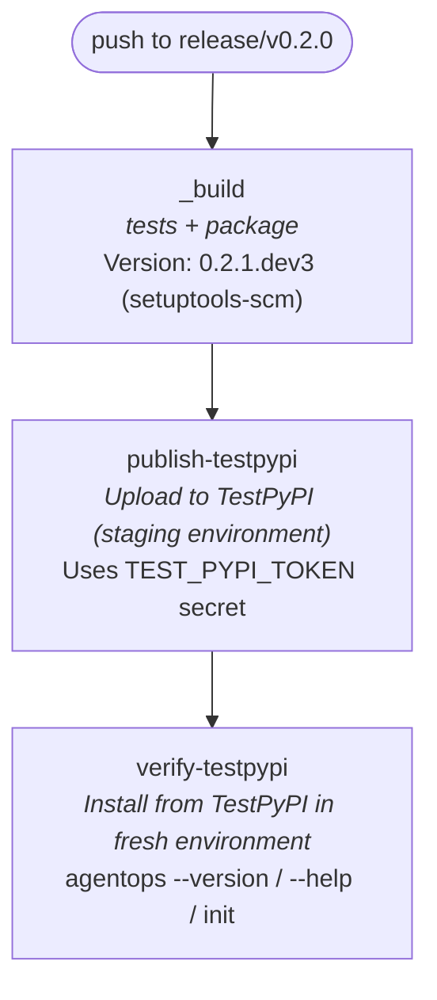
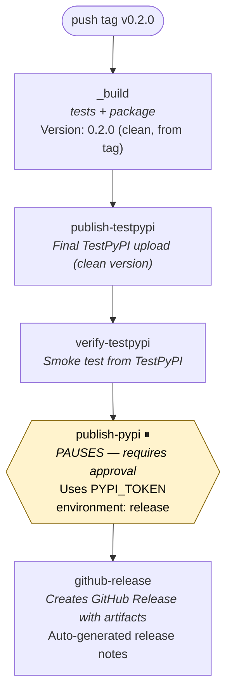
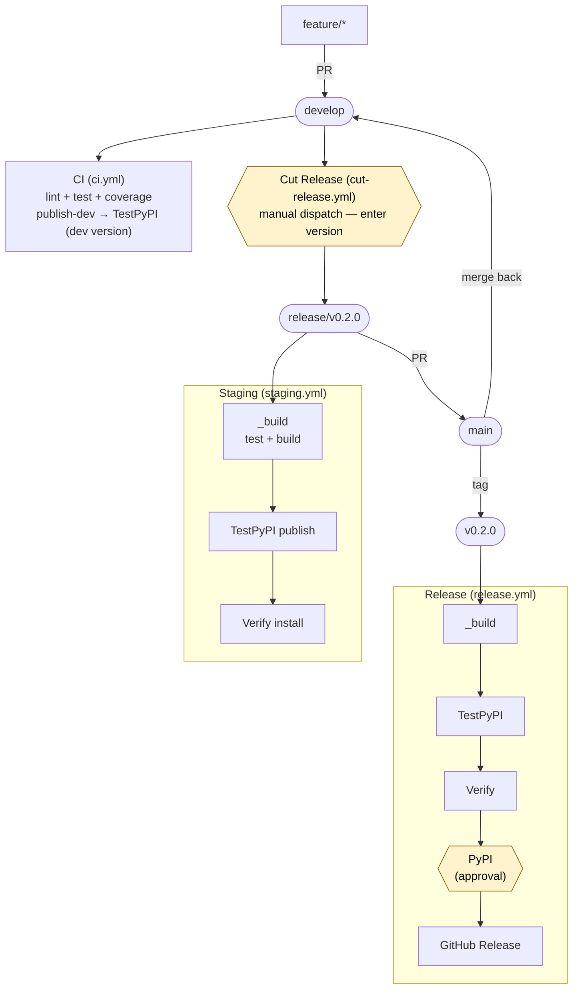

# GitOps Guide: Building and Releasing AgentOps Toolkit

This guide is a comprehensive instruction manual for engineers working on the **agentops-toolkit** project. It covers the full GitOps lifecycle — from setting up your development environment, through the branching model and CI pipeline, to staging and production releases.

## Table of Contents

- [1. GitOps Principles](#1-gitops-principles)
- [2. Branching Model](#2-branching-model)
- [3. Development Environment Setup](#3-development-environment-setup)
- [4. Development Workflow](#4-development-workflow)
- [5. CI Pipeline (Continuous Integration)](#5-ci-pipeline-continuous-integration)
- [6. Versioning with setuptools-scm](#6-versioning-with-setuptools-scm)
- [7. Staging Pipeline (TestPyPI)](#7-staging-pipeline-testpypi)
- [8. End-to-End Pipeline Testing](#8-end-to-end-pipeline-testing)
- [9. Production Release Pipeline (PyPI)](#9-production-release-pipeline-pypi)
- [10. Infrastructure Setup](#10-infrastructure-setup)
- [11. Workflow File Reference](#11-workflow-file-reference)
- [12. Release Checklist](#12-release-checklist)
- [13. Troubleshooting](#13-troubleshooting)

## 1. GitOps Principles

AgentOps follows GitOps practices where **git is the single source of truth** for both code and operational state:

- **Declarative configuration** — All pipeline behavior is defined in YAML workflow files checked into the repository.
- **Version-controlled releases** — Every release is traceable to a git tag. No manual version edits.
- **Automated pipelines** — Pushing branches or tags triggers the corresponding workflow automatically.
- **Environment gates** — Production deployment requires explicit human approval via GitHub Environments.
- **Immutable artifacts** — Built packages are uploaded once and reused across pipeline stages (no rebuilds between TestPyPI and PyPI).

## 2. Branching Model

AgentOps uses a modified [Git Flow](https://nvie.com/posts/a-successful-git-branching-model/) strategy:

```
main              ← always production-ready, receives merges from release/* branches
  │
develop           ← integration branch, all feature PRs target here
  │
  ├── feature/*   ← individual features branched from develop
  │
  └── release/*   ← release preparation, branched from develop when ready to ship
```

### Branch Purposes

| Branch           | Purpose                                                              | Who creates      | Merges into                   |
| ---------------- | -------------------------------------------------------------------- | ---------------- | ----------------------------- |
| `main`           | Production-ready code. Every commit here should be a tagged release. | Maintainers only | —                             |
| `develop`        | Integration branch. All feature work flows through here.             | —                | `main` (via release branches) |
| `feature/*`      | Individual features, bug fixes, or improvements.                     | Any contributor  | `develop`                     |
| `release/v0.X.Y` | Release stabilization and staging. Triggers TestPyPI pipeline.       | Maintainers      | `main`                        |

### Branch Lifecycle

```
1. feature/my-change ──PR──→ develop       (contributor)
2. develop ──branch──→ release/v0.2.0      (maintainer, when ready to release)
3. release/v0.2.0 ──PR──→ main            (maintainer, after staging validates)
4. main ──tag──→ v0.2.0                    (maintainer, triggers production release)
5. main ──merge──→ develop                 (maintainer, sync the tag back)
6. release/v0.2.0 ──delete──               (maintainer, cleanup)
```

### Branch Protection Rules (Recommended)

Configure these in **Settings → Branches → Branch protection rules**:

| Branch      | Rules                                                                    |
| ----------- | ------------------------------------------------------------------------ |
| `main`      | Require PR, require status checks (CI), require approvals, no force push |
| `develop`   | Require PR, require status checks (CI), no force push                    |
| `release/*` | Require status checks (Staging pipeline), no force push                  |

## 3. Development Environment Setup

### Prerequisites

- Python 3.11 or later
- [uv](https://docs.astral.sh/uv/) (recommended) or pip
- Git with access to the repository

### First-Time Setup

```bash
# 1. Clone the repository
git clone https://github.com/Azure/agentops.git
cd agentops

# 2. Install uv (if not already installed)
# macOS/Linux:
curl -LsSf https://astral.sh/uv/install.sh | sh
# Windows:
powershell -ExecutionPolicy ByPass -c "irm https://astral.sh/uv/install.ps1 | iex"

# 3. Install the project and dev dependencies
uv sync --group dev

# 4. Verify the installation
uv run agentops --version
uv run pytest tests/ -x -q
```

### Alternative Setup (pip)

```bash
python -m venv .venv
# Windows:
.venv\Scripts\Activate.ps1
# macOS/Linux:
source .venv/bin/activate

pip install -e .
pip install pytest
agentops --version
python -m pytest tests/ -x -q
```

### Verify Your Setup

After installation, these commands should all succeed:

```bash
# CLI works
agentops --version          # Shows version like 0.1.3.dev6
agentops --help             # Shows available commands

# Tests pass
uv run pytest tests/ -x -q  # All tests should pass

# Version from git
python -m setuptools_scm    # Shows version derived from git tags
```

## 4. Development Workflow

### Creating a Feature

```bash
# 1. Start from the latest develop
git checkout develop
git pull origin develop

# 2. Create your feature branch
git checkout -b feature/my-new-feature

# 3. Make changes, commit, push
# ... edit files ...
uv run pytest tests/ -x -q          # Run tests before committing
git add .
git commit -m "feat: add my new feature"
git push origin feature/my-new-feature

# 4. Open a PR targeting develop
#    GitHub will run the CI pipeline automatically
```

### PR Requirements

Before your PR can be merged to `develop`:

1. **CI pipeline passes** — lint + tests across OS/Python matrix
2. **Code review approved** — at least one reviewer
3. **Architecture rules followed** — see [CONTRIBUTING.md](../CONTRIBUTING.md)
4. **Tests included** — unit tests in `tests/unit/`, integration tests if needed
5. **CHANGELOG updated** — add entry under the appropriate versioned section for user-visible changes

### After Your PR is Merged

```bash
# Sync your local develop
git checkout develop
git pull origin develop

# Delete your feature branch
git branch -d feature/my-new-feature
```

## 5. CI Pipeline (Continuous Integration)

The CI pipeline runs on **every push and PR** to `main` or `develop`.

**Workflow file**: `.github/workflows/ci.yml`

### Jobs

| Job | What it does | Runs on |
| --- | --- | --- |
| **lint** | `ruff check` (linting) + `mypy` (type checking, soft-fail) | Ubuntu, Python 3.11 |
| **test** | `pytest tests/` with JUnit XML output | Matrix: 2 OS × 3 Python versions |
| **coverage** | `pytest --cov` with XML coverage report | Ubuntu, Python 3.13 (after tests pass) |
| **publish-dev** | Build package + publish to TestPyPI (develop pushes only) | Ubuntu, Python 3.12 (after lint + test pass) |
| **verify-dev** | Install from TestPyPI + smoke test (develop pushes only) | Ubuntu, Python 3.12 (after publish-dev) |

The `publish-dev` and `verify-dev` jobs only run on pushes to `develop` (not on PRs). Every merged PR automatically produces an installable dev build on TestPyPI with a version like `0.1.3.dev12`.

### Test Matrix

| OS      | Python 3.11 | Python 3.12 | Python 3.13 |
| ------- | ----------- | ----------- | ----------- |
| Ubuntu  | ✅           | ✅           | ✅           |
| Windows | ✅           | ✅           | ✅           |

### What CI Catches

- Syntax and style issues (ruff)
- Type errors (mypy, non-blocking)
- Test failures across platforms
- Import errors or missing dependencies
- Regression in exit code behavior

### Viewing CI Results

1. Go to the **Actions** tab → find the CI run for your PR
2. Click into a failing job to see the error
3. Download test result artifacts if needed

## 6. Versioning with setuptools-scm

AgentOps uses [setuptools-scm](https://github.com/pypa/setuptools-scm) for **fully automatic versioning**. There is **no `version` field in `pyproject.toml`** — the version is derived from git tags at build time.

### How It Works

setuptools-scm reads your git history and computes the version:

| Git state                                     | Example version | Explanation                   |
| --------------------------------------------- | --------------- | ----------------------------- |
| Exactly on tag `v0.2.0`                       | `0.2.0`         | Clean release version         |
| 3 commits after `v0.2.0`                      | `0.2.1.dev3`    | Dev version, 3 commits ahead  |
| 10 commits after `v0.1.2` on `release/v0.2.0` | `0.1.3.dev10`   | Dev version on release branch |

### Configuration

In `pyproject.toml`:

```toml
[build-system]
requires = ["setuptools>=68", "wheel", "setuptools-scm>=8"]

[project]
dynamic = ["version"]    # Version comes from setuptools-scm, not a static field

[tool.setuptools_scm]
local_scheme = "no-local-version"   # Strips +hash suffix (PyPI rejects local versions)
```

### Checking the Version

```bash
# From the installed CLI
agentops --version

# From setuptools-scm directly
python -m setuptools_scm

# From Python code
python -c "from agentops import __version__; print(__version__)"
```

### Rules

- **Never add `version = "..."` to `pyproject.toml`** — this will conflict with setuptools-scm.
- **Tags must follow PEP 440** — use `v0.2.0`, not `release-0.2.0` or `0.2.0`.
- **`fetch-depth: 0`** is required in CI checkout steps — setuptools-scm needs the full git history.
- **`pip install -e .` requires `.git`** — editable installs need the git directory present (standard for development).

## 7. Staging Pipeline (TestPyPI)

The staging pipeline validates a release candidate by publishing to TestPyPI and verifying the installed package works.

**Workflow file**: `.github/workflows/staging.yml`

**Trigger**: Push to any `release/*` branch

### Pipeline Flow



### What Gets Validated

1. **Tests pass** — the full test suite runs before building
2. **Package builds** — setuptools-scm generates the correct version, wheel and sdist are created
3. **Package uploads** — the built artifacts successfully upload to TestPyPI
4. **Package installs** — `pip install` from TestPyPI resolves all dependencies
5. **CLI works** — `agentops --version` and `--help` run without errors
6. **Init works** — `agentops init` creates the expected workspace files

### Iterating on a Release Branch

If staging fails, fix the issue and push again:

```bash
# On your release/v0.2.0 branch
# ... fix the issue ...
git add .
git commit -m "fix: correct packaging issue"
git push origin release/v0.2.0
# Staging pipeline re-runs automatically
```

Each push generates a new dev version (e.g. `0.2.1.dev4`, `0.2.1.dev5`), so there are no version conflicts on TestPyPI. The `skip-existing: true` flag also prevents failures if the same version is re-uploaded.

### Manual Verification (Optional)

After the staging pipeline passes, you can manually test the package:

```bash
# Install the specific dev version from TestPyPI
pip install "agentops-toolkit==0.2.1.dev3" \
  --index-url https://test.pypi.org/simple/ \
  --extra-index-url https://pypi.org/simple/

agentops --version
agentops --help

# Test init in a temp directory
cd $(mktemp -d)
agentops init
ls .agentops/
```

> **Note**: `--extra-index-url https://pypi.org/simple/` is required so that dependencies (typer, pydantic, ruamel.yaml) resolve from the real PyPI.

## 8. End-to-End Pipeline Testing

Before cutting a real release, you can validate the entire pipeline end-to-end using a disposable test branch and tag. This is especially useful when:

- You've modified any workflow file (`_build.yml`, `staging.yml`, `release.yml`)
- You've changed `pyproject.toml` build configuration
- You've updated setuptools-scm settings
- A new engineer wants to understand the release process hands-on

### 8.1 Test the Staging Pipeline

#### Step 1: Create a Test Release Branch

From the branch that contains your workflow changes (or from `develop`):

```bash
git checkout develop          # or your feature branch with workflow changes
git pull origin develop
git checkout -b release/v0.0.0-test
git push origin release/v0.0.0-test
```

This triggers the `staging.yml` workflow automatically.

#### Step 2: Monitor the Pipeline

1. Go to **Actions** tab → find the **Staging** workflow run for `release/v0.0.0-test`
2. Watch all 3 jobs:

```
Job 1: build / build        → Should tests pass? Package build?
Job 2: publish-testpypi     → Does TestPyPI upload succeed?
Job 3: verify-testpypi      → Can the package install and run?
```

3. Click into each job to inspect step-level output
4. If a job fails, read the logs, fix the issue, push again:

```bash
# Fix and re-push
git add .
git commit -m "fix: correct workflow issue"
git push origin release/v0.0.0-test
# Pipeline re-runs automatically
```

#### Step 3: Verify on TestPyPI (Optional)

Confirm the test package appeared on TestPyPI:

```bash
# Check the version that was published
python -m setuptools_scm

# Install and test manually
pip install "agentops-toolkit==$(python -m setuptools_scm)" \
  --index-url https://test.pypi.org/simple/ \
  --extra-index-url https://pypi.org/simple/

agentops --version
agentops --help

# Test init
cd $(mktemp -d)
agentops init
ls .agentops/
```

#### Step 4: Clean Up the Test Branch

```bash
# Delete remote branch
git push origin --delete release/v0.0.0-test

# Switch back and delete local branch
git checkout develop
git branch -d release/v0.0.0-test
```

### 8.2 Test the Full Release Pipeline (Including PyPI Approval Gate)

> **Warning**: This will publish a test version to PyPI if you approve it. Only do this if you want to validate the full production flow. You can cancel at the approval gate to skip the actual PyPI publish.

#### Step 1: Create a Test Tag

From `develop` or your feature branch:

```bash
git tag v0.0.0-test.1
git push origin v0.0.0-test.1
```

This triggers the `release.yml` workflow.

#### Step 2: Monitor the Pipeline

1. Go to **Actions** tab → find the **Release** workflow run for `v0.0.0-test.1`
2. Watch the jobs execute in sequence:

```
Job 1: build / build        ✅ Tests + build
Job 2: publish-testpypi     ✅ Upload to TestPyPI
Job 3: verify-testpypi      ✅ Install + smoke test
Job 4: publish-pypi         ⏸️  PAUSES — waiting for approval
Job 5: github-release       ⏳ Waiting for Job 4
```

3. At the `publish-pypi` step, you have two choices:
   - **Approve** — publishes to real PyPI (use only if you want to test the full flow)
   - **Reject** — cancels the remaining jobs without publishing to PyPI

#### Step 3: Inspect the Approval Gate

1. Click on the **Release** workflow run
2. The `publish-pypi` job shows a yellow "Waiting" badge
3. Click **Review deployments**
4. Select the **release** environment
5. Choose **Reject** to cancel without publishing, or **Approve and deploy** to continue

This validates that the environment protection rules and reviewer requirements work correctly.

#### Step 4: Clean Up

```bash
# Delete the test tag (remote and local)
git push origin --delete v0.0.0-test.1
git tag -d v0.0.0-test.1

# If a GitHub Release was created, delete it manually:
# Go to Releases → find v0.0.0-test.1 → Delete
```

If you approved the PyPI publish, the test version (`0.0.0.test1`) will exist on PyPI permanently (PyPI versions cannot be deleted, only yanked). This is harmless but visible.

### 8.3 Quick E2E Test Summary

| What to test        | Command                                                              | What to watch                     |
| ------------------- | -------------------------------------------------------------------- | --------------------------------- |
| Staging only        | `git push origin release/v0.0.0-test`                                | 3 jobs: build → TestPyPI → verify |
| Full release (safe) | `git push origin v0.0.0-test.1` then **reject** at approval          | 4 jobs run, approval gate works   |
| Full release (real) | `git push origin v0.0.0-test.1` then **approve**                     | All 5 jobs, package on PyPI       |
| Cleanup (branch)    | `git push origin --delete release/v0.0.0-test`                       | Branch removed                    |
| Cleanup (tag)       | `git push origin --delete v0.0.0-test.1 && git tag -d v0.0.0-test.1` | Tag removed                       |

### 8.4 Testing Workflow Changes on a Feature Branch

If you're modifying the workflow files on a feature branch (not yet merged to `develop`), you can still test them:

```bash
# Your workflow changes are on feature/my-ci-changes
git checkout feature/my-ci-changes

# Create a test release branch directly from your feature branch
git checkout -b release/v0.0.0-test
git push origin release/v0.0.0-test

# GitHub Actions uses the workflow files from the pushed branch,
# so your modifications are what actually runs
```

This is useful because GitHub Actions reads workflow files from the branch being pushed, not from `main` or `develop`. Your modified workflows execute immediately without needing to merge first.

After testing:

```bash
# Clean up
git push origin --delete release/v0.0.0-test
git checkout feature/my-ci-changes
git branch -d release/v0.0.0-test
```

## 9. Production Release Pipeline (PyPI)

The production pipeline publishes a final release to PyPI and creates a GitHub Release.

**Workflow file**: `.github/workflows/release.yml`

**Trigger**: Push a `v*` tag (e.g. `v0.2.0`)

### Pipeline Flow



### Step-by-Step: Cutting a Release

#### Step 1: Cut the Release (One-Click)

1. Go to the **Actions** tab → select **Cut Release** workflow
2. Click **Run workflow**
3. Enter the version (e.g. `0.2.0`) — no `v` prefix
4. Click **Run workflow**

The workflow automatically:
- Creates `release/v0.2.0` from `develop`
- Updates `CHANGELOG.md` (adds versioned section `[0.2.0] - YYYY-MM-DD`)
- Pushes the branch (triggers [staging pipeline](#7-staging-pipeline-testpypi))
- Opens a PR: `release/v0.2.0` → `main`

> **Alternative (manual)**: If you prefer to create the release branch locally:
> ```bash
> git checkout develop && git pull origin develop
> git checkout -b release/v0.2.0
> # Edit CHANGELOG.md manually
> git commit -m "chore: prepare release 0.2.0"
> git push origin release/v0.2.0
> ```

#### Step 2: Wait for Staging

The branch push triggers the staging pipeline automatically. Wait for it to pass.

#### Step 3: Monitor Staging

1. Go to **Actions** tab → find the **Staging** workflow run
2. Verify all 3 jobs pass:
   - ✅ `build / build` — tests pass, package builds
   - ✅ `publish-testpypi` — uploaded to TestPyPI
   - ✅ `verify-testpypi` — installed and smoke-tested

If any job fails, fix the issue on the release branch and push. The pipeline re-runs automatically.

#### Step 4: Merge to Main

Create a PR from `release/v0.2.0` → `main` (or use the one already opened by Cut Release):

1. Go to GitHub → **Pull Requests** → **New Pull Request**
2. Base: `main` ← Compare: `release/v0.2.0`
3. Title: `Release v0.2.0`
4. Get the required reviews and merge

#### Step 5: Tag the Release

```bash
git checkout main
git pull origin main
git tag v0.2.0
git push origin v0.2.0
```

This triggers the [production release pipeline](#8-production-release-pipeline-pypi).

#### Step 6: Approve the PyPI Publish

1. Go to **Actions** tab → find the **Release** workflow run for `v0.2.0`
2. The pipeline will run through build → TestPyPI → verify
3. At the `publish-pypi` job, it pauses with **"Waiting for review"**
4. Click **Review deployments** → select the **release** environment → **Approve and deploy**
5. The package publishes to PyPI
6. The `github-release` job creates a GitHub Release with the built artifacts and auto-generated release notes

#### Step 7: Post-Release Cleanup

```bash
# Sync the tag back to develop
git checkout develop
git pull origin develop
git merge main
git push origin develop

# Delete the release branch (remote and local)
git push origin --delete release/v0.2.0
git branch -d release/v0.2.0
```

#### Step 8: Verify the Published Package

```bash
# Install from PyPI
pip install agentops-toolkit==0.2.0

# Verify
agentops --version    # Should show 0.2.0
agentops --help
```

Check the published package:
- PyPI: https://pypi.org/project/agentops-toolkit/0.2.0/
- GitHub Release: https://github.com/Azure/agentops/releases/tag/v0.2.0

## 10. Infrastructure Setup

This section covers one-time setup required before the pipelines can run.

### 10.1 GitHub Environments

Create two environments in **Settings → Environments → New environment**:

#### `staging` Environment

- **Purpose**: Controls access to TestPyPI publishing
- **Protection rules**: None required (auto-deploys), or add reviewers for extra safety
- **Secrets**:

  | Secret            | Value              | How to get it                                                                     |
  | ----------------- | ------------------ | --------------------------------------------------------------------------------- |
  | `TEST_PYPI_TOKEN` | TestPyPI API token | [test.pypi.org/manage/account/token](https://test.pypi.org/manage/account/token/) |

#### `release` Environment

- **Purpose**: Controls access to production PyPI publishing
- **Protection rules**: **Required reviewers** — add at least one team member who must approve
- **Deployment branches**: Optionally restrict to `main` branch and `v*` tags
- **Secrets**:

  | Secret       | Value                                         | How to get it                                                           |
  | ------------ | --------------------------------------------- | ----------------------------------------------------------------------- |
  | `PYPI_TOKEN` | PyPI API token (scoped to `agentops-toolkit`) | [pypi.org/manage/account/token](https://pypi.org/manage/account/token/) |

### 10.2 PyPI and TestPyPI Accounts

#### TestPyPI (Staging)

1. Go to [test.pypi.org/account/register](https://test.pypi.org/account/register/)
2. Create an account (separate from PyPI — different databases)
3. Go to [test.pypi.org/manage/account/token](https://test.pypi.org/manage/account/token/)
4. Create an API token (scope: entire account for first upload, then project-scoped after)
5. Add the token as `TEST_PYPI_TOKEN` secret in the GitHub `staging` environment

> **Note**: TestPyPI and PyPI are completely separate systems with separate accounts, tokens, and namespaces. An account on one does not grant access to the other.

#### PyPI (Production)

1. Go to [pypi.org/account/register](https://pypi.org/account/register/) or log in
2. Go to [pypi.org/manage/account/token](https://pypi.org/manage/account/token/)
3. Create an API token scoped to the `agentops-toolkit` project
4. Add the token as `PYPI_TOKEN` secret in the GitHub `release` environment

### 10.3 First-Time Package Registration

The first time you publish to TestPyPI or PyPI, the project name (`agentops-toolkit`) is registered automatically. After the first upload:

- Scope your API tokens to the specific project for better security
- Add collaborators/maintainers on the PyPI/TestPyPI project page if needed

## 11. Workflow File Reference

All workflow files are in `.github/workflows/`:

### `ci.yml` — Continuous Integration

```
Trigger: push to develop, PR to develop
Flow:    lint → test (matrix) → coverage
         + on develop push: publish-dev → verify-dev (TestPyPI)
Purpose: Quality gate for all code changes; auto-publish dev builds
```

Key detail: `publish-dev` and `verify-dev` only run on pushes to `develop` (not PRs). Every merge to develop produces a dev version on TestPyPI (e.g. `0.1.3.dev12`) via setuptools-scm. PRs to `main` are not covered by CI because they come from `release/*` branches which are already validated by the staging pipeline.

### `_build.yml` — Reusable Build

```
Trigger: workflow_call (called by staging.yml and release.yml)
Flow:    checkout (full history) → uv sync → pytest → uv build → upload artifact
Purpose: Single source of truth for the build process
```

Key detail: Uses `fetch-depth: 0` to ensure setuptools-scm has full git history for version derivation.

### `staging.yml` — Staging Pipeline

```
Trigger: push to release/* branches, or workflow_dispatch
Flow:    _build → publish-testpypi → verify-testpypi
Purpose: Validate release candidates before production
```

Key details:
- `skip-existing: true` allows re-pushes without upload failures
- Verify step uses a retry loop (5 attempts, 30s apart) for TestPyPI index propagation
- Smoke tests cover `--version`, `--help`, and `agentops init`

### `release.yml` — Production Release

```
Trigger: push v* tags, or workflow_dispatch
Flow:    _build → publish-testpypi → verify-testpypi → publish-pypi (approval) → github-release
Purpose: Publish to PyPI and create GitHub Release
```

Key details:
- `publish-pypi` uses `environment: release` which requires reviewer approval
- `github-release` uses `gh release create` with `--generate-notes` for automatic release notes
- Built artifacts (.whl, .tar.gz) are attached to the GitHub Release

### `cut-release.yml` — Cut Release (Manual Dispatch)

```
Trigger: workflow_dispatch (manual button in Actions tab)
Input:   version — semver string (e.g. 0.2.0)
Flow:    validate → create release branch → update CHANGELOG → push → open PR
Purpose: One-click release branch creation from develop
```

Key details:
- Creates `release/v<version>` branch from `develop`
- Automatically updates `CHANGELOG.md` — inserts a versioned section `[<version>] - <date>` at the top
- Opens a PR from `release/v<version>` → `main` with a checklist
- The branch push triggers `staging.yml` automatically
- Fails safely if the branch already exists
- Does NOT auto-tag or auto-publish — tagging remains a manual, intentional step

## 12. Release Checklist

Use this checklist when cutting a release:

**Preparation**
- [ ] All intended features/fixes are merged to `develop`
- [ ] `CHANGELOG.md` has entries for all user-visible changes under the appropriate versioned section
- [ ] Tests pass locally: `uv run pytest tests/ -x -q`
- [ ] Version from setuptools-scm looks correct: `python -m setuptools_scm`

**Staging**
- [ ] Release branch created via **Cut Release** workflow (or manually)
- [ ] CHANGELOG automatically updated with version and date
- [ ] Staging pipeline passes: build + TestPyPI + verify (all 3 green)
- [ ] PR opened: `release/v0.X.Y` → `main`

**Production**
- [ ] PR from `release/v0.X.Y` → `main` created and approved
- [ ] PR merged to `main`
- [ ] Version tag created and pushed: `v0.X.Y`
- [ ] Release pipeline runs: build + TestPyPI + verify pass
- [ ] PyPI publish approved in GitHub Actions
- [ ] GitHub Release created with artifacts
- [ ] Published package verified: `pip install agentops-toolkit==0.X.Y`

**Cleanup**
- [ ] `main` merged back to `develop`
- [ ] Release branch deleted (remote and local)
- [ ] CHANGELOG is ready for new entries

## 13. Troubleshooting

### Build Failures

| Problem                                  | Cause                               | Solution                                      |
| ---------------------------------------- | ----------------------------------- | --------------------------------------------- |
| `setuptools_scm` can't determine version | Shallow clone (missing git history) | Ensure `fetch-depth: 0` in checkout step      |
| Version shows `0.0.0` locally            | Not in a git repo or no tags exist  | Run `git tag v0.0.1` to create an initial tag |
| `ModuleNotFoundError` in tests           | Dependencies not installed          | Run `uv sync --group dev`                     |
| Tests fail on Windows but pass on Linux  | Path separator issues               | Use `pathlib.Path`, not string concatenation  |

### TestPyPI Issues

| Problem                                       | Cause                            | Solution                                                                                                                |
| --------------------------------------------- | -------------------------------- | ----------------------------------------------------------------------------------------------------------------------- |
| Upload fails with 403                         | Invalid or expired token         | Regenerate `TEST_PYPI_TOKEN` and update the GitHub secret                                                               |
| Upload fails with "already exists"            | Same version previously uploaded | Normal — `skip-existing: true` handles this. If you need a new upload, push another commit to increment the dev version |
| Install fails with "no matching distribution" | Package not yet indexed          | The verify job retries automatically (5 attempts, 30s apart). If persistent, check TestPyPI status                      |
| Install fails with dependency errors          | Dependency not on TestPyPI       | Verify `--extra-index-url https://pypi.org/simple/` is present                                                          |

### PyPI Issues

| Problem                                    | Cause                                     | Solution                                                       |
| ------------------------------------------ | ----------------------------------------- | -------------------------------------------------------------- |
| Publish step stuck on "Waiting for review" | Normal — requires approval                | A designated reviewer must approve in the Actions UI           |
| Upload fails with 403                      | Invalid `PYPI_TOKEN`                      | Regenerate the token on pypi.org and update the GitHub secret  |
| Version already exists on PyPI             | Tag points to an already-released version | PyPI versions are immutable. You must use a new version number |

### Git and Version Issues

| Problem                                     | Cause                          | Solution                                                                                         |
| ------------------------------------------- | ------------------------------ | ------------------------------------------------------------------------------------------------ |
| Wrong version in built package              | Tag not on the expected commit | Verify with `git log --oneline --decorate` that the tag is where you expect                      |
| `pip install -e .` fails                    | `.git` directory missing       | Editable installs need git history for setuptools-scm. Clone the repo, don't just download a zip |
| Merge conflicts between release and develop | Normal for concurrent work     | Resolve conflicts on the release branch before merging to main                                   |

### Environment and Permissions

| Problem                           | Cause                               | Solution                                                               |
| --------------------------------- | ----------------------------------- | ---------------------------------------------------------------------- |
| "Environment not found" error     | GitHub Environment not created      | Create `staging` and `release` environments in Settings → Environments |
| "Secret not found" error          | Secret not added to the environment | Add secrets to the specific environment, not repository-level secrets  |
| Reviewer can't approve deployment | Not listed as required reviewer     | Update the environment's required reviewers list                       |

## Architecture Diagram


